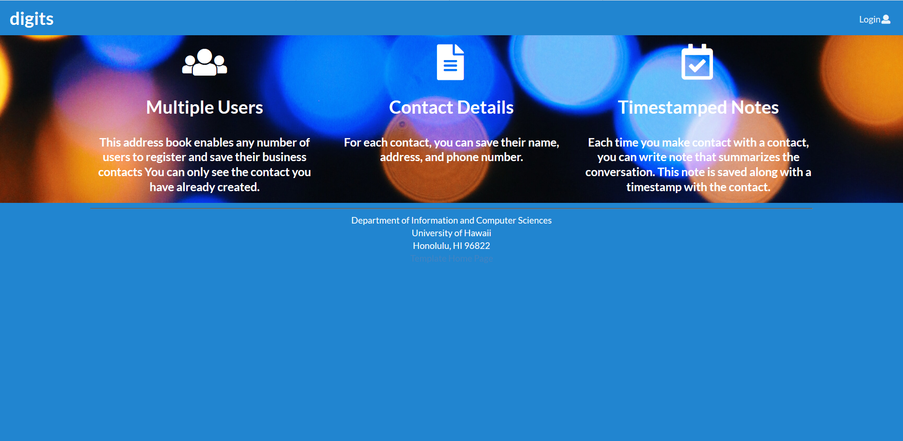
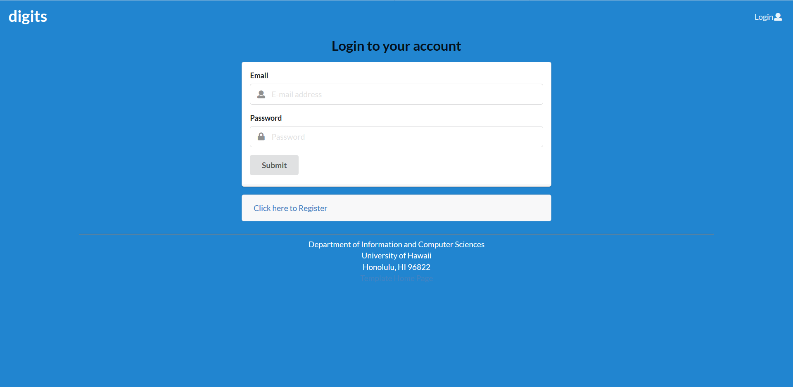
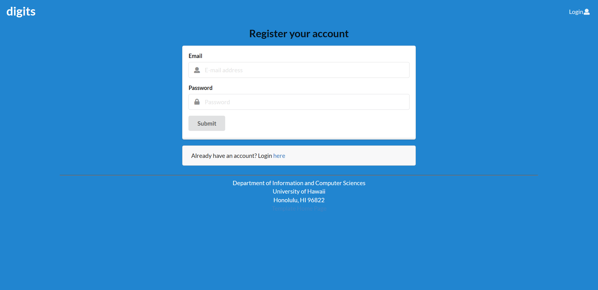
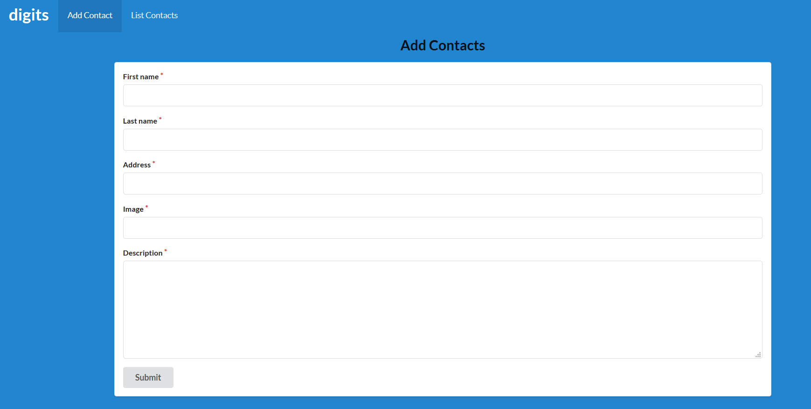
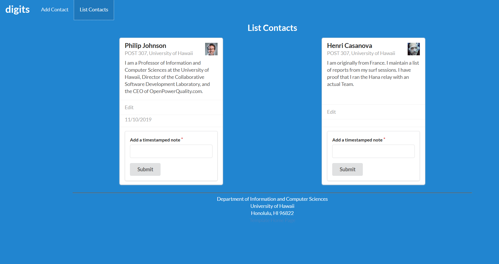
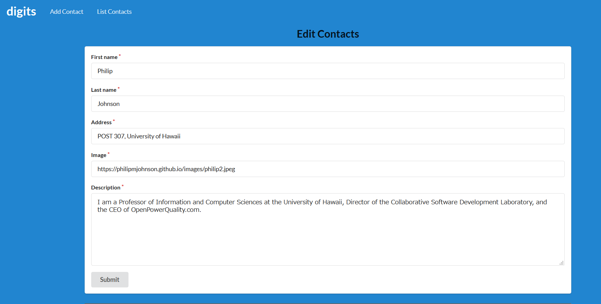

## Installation

First, [install Meteor](https://www.meteor.com/install).

Second, go to [https://github.com/ics-software-engineering/meteor-application-template-react](https://github.com/ics-software-engineering/meteor-application-template-react), and click the "Use this template" button. Complete the dialog box to create a new repository that you own that is initialized with this template's files.

Third, go to your newly created repository, and click the "Clone or download" button to download your new GitHub repo to your local file system.  Using [GitHub Desktop](https://desktop.github.com/) is a great choice if you use MacOS or Windows.

Fourth, cd into the app/ directory of your local copy of the repo, and install third party libraries with:

```
$ meteor npm install
```

#### Landing page

When you retrieve the app at http://localhost:3000, this is what should be displayed:



The next step is to use the Login menu to either Login to an existing account or register a new account.

#### Login page

Clicking on the Login link, then on the Sign In menu item displays this page:



#### Register page

Alternatively, clicking on the Login link, then on the Sign Up menu item displays this page:



#### Landing (after Login) page, non-Admin user

Once you log in (either to an existing account or by creating a new one), the navbar changes as follows:


You can now add new Contacts, and list Contacts you have added. 

#### Add Contact page

After logging in, here is the page that allows you to add new Contacts:



#### List Contacts page

After logging in, here is the page that allows you to list all the Contacts you have added.



You click the "Edit" link to go to the Edit Stuff page, shown next.

#### Edit Contact page

After clicking on the "Edit" link associated with a Contact, this page displays that allows you to change and save it:



#### Landing (after Login), Admin user

You can define an "admin" user in the settings.json file. This user, after logging in, gets a special entry in the navbar that lists all Contacts added in the database:


